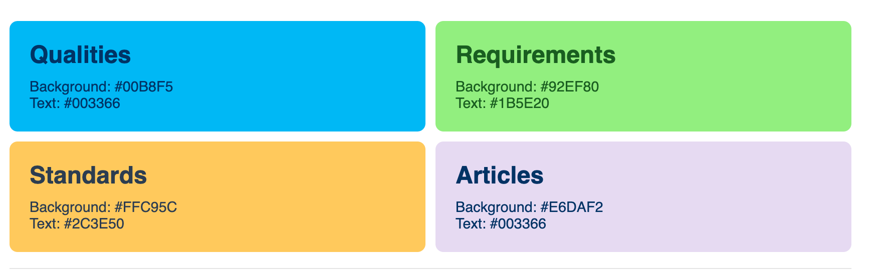

# arc42 Quality model

[](https://uptime.betterstack.com/?utm_source=status_badge)

Here we collect definitions of quality attributes and their relationships .


It's powered by Jekyll and a modified TTSCK theme (see below).
We use Liquid for extensive automatic hyperlinking along the dependencies you see in the model above.


## License

As all of the arc42 content, this FAQ is free to use under a liberal Creative-Commons
license:


This work is licensed under a
[Creative Commons Attribution-ShareAlike 4.0 International License](https://creativecommons.org/licenses/by-sa/4.0/).

## Jekyll TTSCK Theme

For documentation on this theme, see the [original documentation](https://ttskch.github.io/jekyll-ttskch-theme/).

We implemented several enhancements over the original theme (e.g. responsive navigation, thx to Falk Hoppe)

## Color Scheme

The site uses the following color scheme for visual consistency across all content:



These colors are defined in the following css variables:


- qualities: `$brand-color-blue: #00B8F5;` <span style="background-color:#00B8F5; color: #003366; padding: 2px 5px; border-radius: 3px;">preview</span>
- requirements: `--reqs-background-color: #ffb3b3;` <span style="background-color:#ffb3b3; color: #8b0000; padding: 2px 5px; border-radius: 3px;">preview</span>
- standards: `--standard-background-color: #ffc95c;` <span style="background-color:#FFC95C; color: #2C3E50; padding: 2px 5px; border-radius: 3px;">preview</span>
- articles (and generic pages): `--article-background-color: #e6daf2;` <span style="background-color:#E6DAF2; color: #003366; padding: 2px 5px; border-radius: 3px;">preview</span>
  

## How to build & run

### Preconditions

You have an environment that allows to run

- a bash script (`/bin/bash`)
- [docker](https://docs.docker.com/build/building/context/) and [docker-compose](https://docs.docker.com/compose/)

We recommend Docker as the local build/test platform. Non-Docker workflows are not supported.

### Build and test

In the root directory, run `docker compose up`.
This will build the site and start a web server on port 4000.

In case you already had the environment spun up, run `docker compose down` to stop the server so that changes in the
docker-compose.yml file are applied.

Alternatively, use the provided Makefile targets:

| Command | Description |
|---------|-------------|
| `make dev` | Start the development environment (`docker compose up`) |
| `make clean` | Remove the generated `_site` directory |

Notes:
- The esbuild service will run `npm run data` once on startup to generate graph data under `assets/data`.
- The esbuild service will also run `npm run test:links` to validate all internal links.
- If you add or change content that affects tags/related/permalinks, restart the stack (`docker compose down` then `docker compose up`) so data is regenerated.

## How to contribute

Create a fork of [https://github.com/arc42/quality.arc42.org-site](https://github.com/arc42/quality.arc42.org-site).
Change files and create a pull request with your changes using your fork.

Hint: `_todo/qualities` contains qualities whose definitions are missing. You may fill those files with content. Then
move them to the appropriate folder (e.g. `_qualities/<LETTER>/`).

Hint: If you add new files you have to clean-rebuild the whole application (stop and start Docker again).

### Adding new content (qualities, requirements, standards)

Front matter conventions used by the site and graph generator:
- `tags`: space-separated string (e.g. `usable secure`)
- `related`: comma-separated list of quality IDs/titles (e.g. `reliability, resilience`)
- `permalink`: stable, kebab-cased URL; the graph uses the last path segment as node ID

Qualities (add under `_qualities/<LETTER>/your-quality.md`):
```yaml
---
title: Availability
tags: reliable
related: reliability, resilience
permalink: /qualities/availability
---
```

Requirements (add under `_requirements/<LETTER>/your-requirement.md`):
```yaml
---
title: Unavailable for max 2 minutes
tags: reliable suitable
related: availability
permalink: /requirements/unavailable-for-max-2-minutes
---
```

#### Requirements Structure

Requirements use a **two-tier approach** for maximum clarity and usefulness as acceptance criteria:

**Tier 1** - Simple requirements (1-3 criteria, self-explanatory):
```markdown
<div class="quality-requirement" markdown="1">

#### Requirement
All automated unit tests must execute quickly to enable rapid feedback.

#### Acceptance Criteria
- All unit tests complete in less than 180 seconds
- Measured on standard CI/CD infrastructure

</div>
```

**Tier 2** - Complex requirements (4+ criteria, needs context):
```markdown
<div class="quality-requirement" markdown="1">

#### Context
Healthcare system manages patient data where poor quality could lead to medication errors.

#### Trigger
Patient data is entered, updated, or accessed throughout care journey.

#### Acceptance Criteria
- Patient duplicate detection rate ≥ 99.9%
- Critical fields 100% complete for active patients
- Lab results available within 5 minutes
- Data validation prevents 100% of impossible values

</div>
```

**Key principles:**
- Use specific metrics with units (percentages, milliseconds, hours)
- Make all criteria testable and measurable
- See [REQUIREMENTS_TEMPLATE.md](REQUIREMENTS_TEMPLATE.md) for detailed guidance

Standards (add under `_standards/your-standard.md`):
```yaml
---
title: "ISO/IEC 25010 - Systems and Software Quality"
permalink: /standards/iso-25010
standard_id: iso25010
---
```
Defaults in `_config.yml` assign layouts automatically for collections; you usually do not need to set `layout`.

### Synonyms

The site supports synonym handling for quality attributes. Some quality terms are synonymous (e.g., "Performance" and "Performance Efficiency"), and the system provides a clean way to handle these:

#### How Synonyms Work

1. **One canonical page** - Only one quality page contains the full definition
2. **Redirect stubs** - Synonym terms redirect to the canonical page
3. **Visual indicators** - Canonical pages show "Also known as" badges
4. **Graph consolidation** - Graph shows single node per concept with tooltip showing all synonym labels

#### Synonym Configuration

Synonyms are defined in `_data/quality-synonyms.yml`:

```yaml
# Format: canonical-slug: [synonym1, synonym2, ...]
performance:
  - performance-efficiency
availability:
  - high-availability
changeability:
  - mutability
time-to-market:
  - speed-to-market
```

#### Creating a Synonym

**Step 1:** Add to `_data/quality-synonyms.yml`
```yaml
your-canonical-term:
  - your-synonym-term
```

**Step 2:** Add `aka` field to canonical quality (`_qualities/<LETTER>/your-canonical-term.md`):
```yaml
---
title: Your Canonical Term
aka: [Your Synonym Term]
tags: relevant
related: other-qualities
permalink: /qualities/your-canonical-term
---
```

**Step 3:** Create redirect stub (`_qualities/<LETTER>/your-synonym-term.md`):
```yaml
---
title: Your Synonym Term
alias_of: your-canonical-term
redirect_to: /qualities/your-canonical-term
layout: redirect
permalink: /qualities/your-synonym-term
---
```

**Step 4:** Rebuild the site
```bash
docker compose down
docker compose up
```

#### Result

- ✅ `/qualities/your-canonical-term` - Shows full definition with "Also known as: Your Synonym Term" badge
- ✅ `/qualities/your-synonym-term` - Redirects instantly to canonical page
- ✅ Graph shows single node with tooltip displaying all synonym labels on hover
- ✅ No 404 errors for synonym URLs

### Tags

Tag links render to `/tag-<tag>`. If you introduce a new tag value in front matter, create a matching page to avoid 404s:
- Copy an existing tag page (`_pages/tag-efficient.md`) to `_pages/tag-<yourtag>.md`
- Adjust the title/permalink and keep the include macros

### Link Validation

The site includes automated link validation to ensure all internal references are correct. The validator checks:

- **Quality → Quality**: References in the `related` field of quality files
- **Quality → Tag**: Tags used in qualities have corresponding tag pages
- **Quality → Standard**: Standards referenced in the `standards` field exist
- **Requirement → Quality**: Requirements reference existing qualities in their `related` field
- **Requirement → Tag**: Tags used in requirements have corresponding tag pages

#### Running Link Validation

**Manual validation:**
```bash
npm run test:links          # Show warnings only
npm run test:links:strict   # Exit with error code 1 if broken links found
```

**Automatic validation:**
Link validation runs automatically when you start Docker (`docker compose up`). Broken links are displayed as warnings but don't stop the build.

**Example output:**
```
═══════════════════════════════════════════════════════════
  LINK VALIDATION REPORT
═══════════════════════════════════════════════════════════

REQUIREMENT→QUALITY (1 errors)
───────────────────────────────────────────────────────────
  ✗ Requirement "patient-data-quality" references non-existent quality "completeness"
    Source: _requirements/P/patient-data-quality.md

═══════════════════════════════════════════════════════════
Total broken links: 1
```

# Technical details

## Graph visualization
The quality graph visualizations are implemented using D3.js forced graphs.
The graph data is stored in JSON files in the `assets/data` directory and loaded by the JavaScript code in the `src/graphs` directory.


## Statistics Utilities

The `statistic-utilities/` directory contains development tools for analyzing repository content. These utilities are **not part of the production build** and are excluded from the Jekyll site.

**Available utilities:**
- **`build-quality-index.js`** - Generates a comprehensive index of all quality attributes with metadata (tags, relationships, standards)
- **`create-index-summary.js`** - Creates statistical summaries (total counts, top-connected qualities, tag distributions)
- **`list-all-qualities.js`** - Displays a human-readable list of all qualities with their properties

**Usage:**
```bash
# Generate quality index
node statistic-utilities/build-quality-index.js

# Create statistical summary
node statistic-utilities/create-index-summary.js

# List all qualities
node statistic-utilities/list-all-qualities.js
```

For detailed documentation, see [`statistic-utilities/README.md`](statistic-utilities/README.md).

## Site Structure and Configuration

This site uses [Jekyll](https://jekyllrb.com/) to generate a static website from a set of Markdown files and templates. 
The following sections explain the key concepts and configurations used in this site.

### Collections

Jekyll's collections are a powerful feature that allows you to group related content together. This site uses collections to manage the different types of content:

*   **Qualities:** These are the quality attributes of a system, such as "Performance" or "Security".
The 'qualities' collection is stored under `./_qualities`.
*   **Requirements:** These are specific quality requirements, which are related to one or more qualities.
The 'requirements' collection is stored under `./_requirements`.
*   **Standards:** These are industry standards related to quality, such as "ISO-25010".

The collections are defined in the `_config.yml` file:

```yaml
collections:
  posts:
    hide: true
  articles:
    output: true
    hide: true
  qualities:
    output: true
    hide: true
  requirements:
    output: true
    hide: true
  standards:
    output: true
    hide: true
```

### Qualities

Qualities are stored in the `_qualities` directory. 
Each quality is a Markdown file with a YAML front matter that contains metadata about the quality.

Here is an example of a quality file (`_qualities/A/accountability.md`):

```yaml
---
title: Accountability
tags: secure
related: security, accessibility, confidentiality, privacy, intrusion-detection, intrusion-prevention
permalink: /qualities/accountability
standards: iso25010
---

Definition:
> ...
```

The front matter contains the following fields:

*   `title`: The title of the quality.
*   `tags`: A list of tags related to the quality.
*   `related`: A list of related qualities.
*   `permalink`: The URL of the quality's page.
*   `standards`: A list of standards that this quality is related to.

### Requirements

Requirements are stored in the `_requirements` directory. 
Each requirement is a Markdown file with a YAML front matter that contains metadata about the requirement.

Here is an example of a requirement file (`_requirements/A/access-control-policy.md`):

```yaml
---
title: Access Control Policy
tags: secure
related: access-control
permalink: /requirements/access-control-policy
---

Context:
> ...
```

The front matter contains the following fields:

*   `title`: The title of the requirement.
*   `tags`: A list of tags related to the requirement.
*   `standards`: A list of standards (like iso25010) where this quality is used/defined/part-of
*   `related`: A list of related qualities.
*   `permalink`: The URL of the requirement's page.

### Layouts and Includes

The site uses a system of layouts and includes to render the content of the collections.

*   **Layouts:** Layouts are templates that define the structure of a page. 
*   The layouts are stored in the `_layouts` directory. 
*   For example, the `standards.html` layout is used to render the pages for the standards collection.
*   **Includes:** Includes are snippets of code that can be reused in different layouts. 
*   The includes are stored in the `_includes` directory. 
*   For example, the `related-qualities.html` include is used to display the list of qualities related to a standard.

This architecture allows for a clean separation of content and presentation, making it easy to manage and extend the site.
