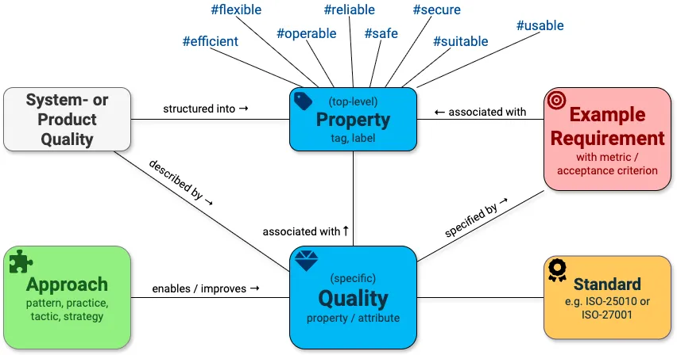

# arc42 Quality model

Here we collect definitions and explanations of 

* _quality attributes_ (short: qualities) and their relationships, plus 
* many practical, real-world examples of _quality requirements_
* quality-related standards, like ISO-25010, ISO-27001, ISO-26262, MISRA and others.





## The website (https://quality.arc42.org)

It's powered by Jekyll and a modified TTSCK theme (see below).
We use Liquid for extensive automatic hyperlinking along the dependencies you see in the model above.


## License
As all of the arc42 content, this FAQ is free to use under a liberal Creative-Commons
license:


This work is licensed under a
[Creative Commons Attribution-ShareAlike 4.0 International License](https://creativecommons.org/licenses/by-sa/4.0/).


## Jekyll TTSCK Theme

For documentation on this theme, see the [original documentation](https://ttskch.github.io/jekyll-ttskch-theme/).

We implemented several enhancements over the original theme (e.g. responsive navigation, thx to Falk Hoppe)

## How to build & run

### Preconditions

You have an environment that allows to run
- a bash script (`/bin/bash`)
- [docker](https://docs.docker.com/build/building/context/) and [docker-compose](https://docs.docker.com/compose/)

### Build and test

In the root directory, run `docker compose up`.


## How to contribute

Create a fork of [https://github.com/arc42/quality.arc42.org-site](https://github.com/arc42/quality.arc42.org-site). Change files and create a pull request with your changes using your fork.

Hint: `_todo-qualities` contains qualities whose definitions are missing. You may fill those files with content. Then move them to the appropriate folder (e.g. `qualities/<letter>/_posts`).

Hint: If you add new files you have to clean-rebuild the whole application.

## Site Architecture and Configuration

This site uses [Jekyll](https://jekyllrb.com/) to generate a static website from a set of Markdown files and templates. The following sections explain the key concepts and configurations used in this site.

### Collections

Jekyll's collections are a powerful feature that allows you to group related content together. This site uses collections to manage the different types of content:

*   **Qualities:** These are the quality attributes of a system, such as "Performance" or "Security".
*   **Requirements:** These are specific quality requirements, which are related to one or more qualities.
*   **Standards:** These are industry standards related to quality, such as "ISO-25010".

The collections are defined in the `_config.yml` file:

```yaml
collections:
  posts:
    hide: true
  articles:
    output: true
    hide: true
  qualities:
    output: true
    hide: true
  requirements:
    output: true
    hide: true
  standards:
    output: true
    hide: true
```

### Qualities

Qualities are stored in the `qualities` directory. Each quality is a Markdown file with a YAML front matter that contains metadata about the quality.

Here is an example of a quality file (`qualities/A/_posts/2022-12-28-accountability.md`):

```yaml
---
title: Accountability
tags: secure
related: security, accessibility, confidentiality, privacy, intrusion-detection, intrusion-prevention
permalink: /qualities/accountability
standards: iso25010
---

Definition:
> ...
```

The front matter contains the following fields:

*   `title`: The title of the quality.
*   `tags`: A list of tags related to the quality.
*   `related`: A list of related qualities.
*   `permalink`: The URL of the quality's page.
*   `standards`: A list of standards that this quality is related to.

### Requirements

Requirements are stored in the `requirements` directory. Each requirement is a Markdown file with a YAML front matter that contains metadata about the requirement.

Here is an example of a requirement file (`requirements/A/_posts/2022-12-28-access-control-policy.md`):

```yaml
---
title: Access Control Policy
tags: secure
related: access-control
permalink: /requirements/access-control-policy
---

Context:
> ...
```

The front matter contains the following fields:

*   `title`: The title of the requirement.
*   `tags`: A list of tags related to the requirement.
*   `related`: A list of related qualities.
*   `permalink`: The URL of the requirement's page.

### Layouts and Includes

The site uses a system of layouts and includes to render the content of the collections.

*   **Layouts:** Layouts are templates that define the structure of a page. The layouts are stored in the `_layouts` directory. For example, the `standards.html` layout is used to render the pages for the standards collection.
*   **Includes:** Includes are snippets of code that can be reused in different layouts. The includes are stored in the `_includes` directory. For example, the `related-qualities.html` include is used to display the list of qualities related to a standard.

This architecture allows for a clean separation of content and presentation, making it easy to manage and extend the site.
