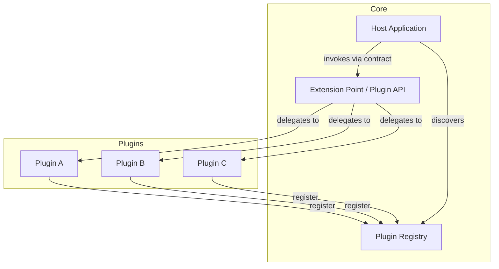

## How It Works

The core application defines one or more **extension points** — typically interfaces or abstract base classes. Plugins implement those interfaces and are discovered by the host either at startup (static loading from a known directory) or at runtime (dynamic loading, e.g. via a service registry or an event bus).

### Common Loading Strategies

- **Static (classpath / file-system scan):** Plugins are placed in a known directory. The host scans and loads them at startup.
- **Service Locator / SPI (Java `ServiceLoader`, Python `entry_points`):** Plugins declare themselves in metadata; the host discovers them without knowing concrete types.
- **Dynamic / hot-plug:** Plugins can be added or removed while the host is running (OSGi, VS Code extension host).
- **Event-driven:** The host publishes lifecycle and data events; plugins subscribe to those they care about, with no direct coupling to the host.

### Plugin Isolation Options

| Isolation level | Mechanism | Trade-off |
| :--- | :--- | :--- |
| None (in-process) | Direct class loading | Maximum performance, any plugin can crash the host |
| Classloader isolation | Separate `ClassLoader` per plugin | Prevents dependency conflicts, moderate overhead |
| Process isolation | Plugin runs as a subprocess | Strong fault isolation, high IPC overhead |
| Container isolation | Plugin in its own container | Maximum isolation, operational complexity |

## Failure Modes

- **API versioning breakage:** Core API changes break existing plugins; semantic versioning and deprecation cycles are essential.
- **Plugin conflicts:** Two plugins modify the same extension point or share incompatible dependency versions, causing unexpected behaviour.
- **Malicious plugins:** Without sandboxing, a plugin has the same privileges as the host — a serious security risk if plugins come from untrusted authors.
- **Discovery failures:** Plugins that fail to register silently are skipped; there is no feedback that an expected capability is missing.
- **Performance unpredictability:** Slow or blocking plugins executed synchronously in the host's call stack degrade overall response time.

## Verification Ideas

- **Contract tests:** For each extension point, maintain a compliance test suite that all plugins must pass (e.g. via a shared test base class).
- **Fault injection:** Force individual plugins to throw exceptions and verify the host continues running with remaining plugins active.
- **Load testing with plugins disabled/enabled:** Measure the overhead of plugin invocation under production-level load; target < 5 % latency increase over a no-plugin baseline.
- **Security scan:** If plugins come from external sources, scan each artifact (SAST, dependency vulnerability check) before allowing installation.

## Related Requirements

- [fast-rollout-of-changes](/requirements/fast-rollout-of-changes)

## Variants

- **Micro-kernel / pipes-and-filters:** The core is reduced to a minimal kernel; almost all behaviour, including built-in features, is implemented as plugins — maximising flexibility but complicating debugging.
- **Extension points vs hooks:** Rather than full plugin loading, the host exposes named hooks (before-save, after-login) that plugins register handlers for — simpler but less powerful.
- **Marketplace model:** Plugins are distributed through a curated registry (VS Code Marketplace, Figma Community), combining discovery with a level of quality control.
