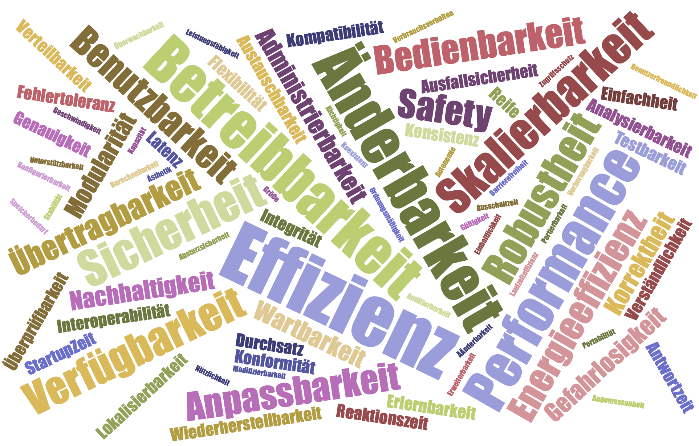
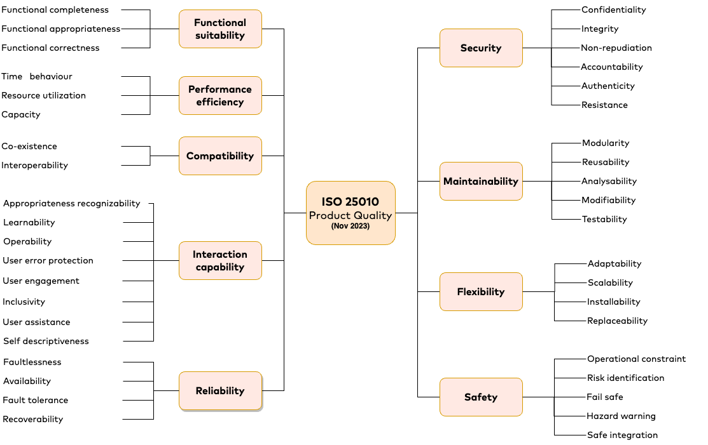
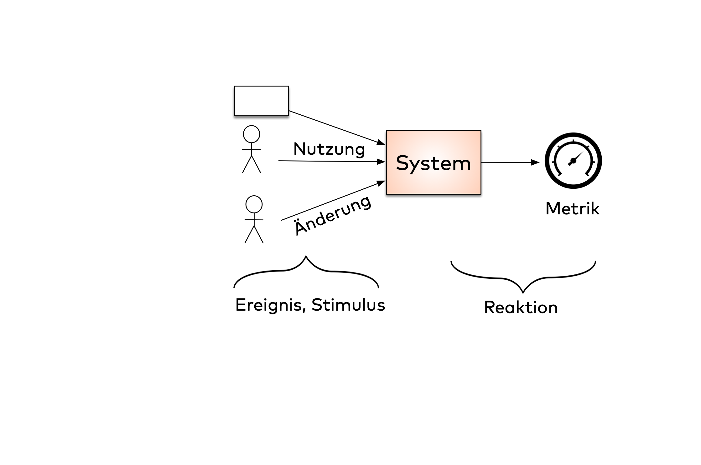
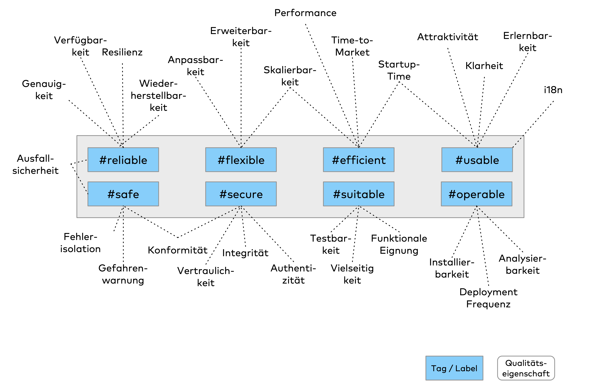

Abstract:
Schnell soll Software laufen, niemals abstürzen, hochgradig ergonomisch zu bedienen und gleichzeitig und kostengünstig zu entwickeln sein. Ach ja, perfekte Datensicherheit versteht sich von selbst.

Schöne Wunschträume – denn alle diese Eigenschaften besitzen eine Gemeinsamkeit: Sie sind (elendig) schwer zu erreichen, und manche Stakeholder haben so ihre eigene Vorstellung, was das denn „genau“ bedeutet.
Hinzu kommt, dass formale Qualitätsmodelle wie ISO-25010 viel Geld kosten,  schon an einfachen praktischen Fragen scheitern und viele Bedürfnisse von Entwicklungsteams ignorieren.

Aber: Es gibt (Open-Source) Alternativen, mit denen Qualität deutlich greifbarer wird.

>## Roter Faden
>
> - [x] Probleme mit dem Begriff
> - [x] Lösung: Qualität als "Menge von Eigenschaften"
> - [x] Umgangssprachliche Definitionen genügen nicht
> - [x] Zwei Dimensionen: Eigenschaft + Ausprägung(en)
> - [x] Merkmale benötigen Meßbarkeit ("Metrologie")
> - [ ] Vorstellung Q42
> - [ ] Ausblick "Quality Driven Software Architecture",
> - [ ] Design-Tactics & Co

## iX-tract

- Qualität ist stark subjektiv, 
- Softwareentwicklung benötigt klare, überprüfbare Anforderungen (_Akzeptanzkriterien_), beispielsweise Qualitätsszenarien
- Das Open-Source Projekt Q42 ([2](#2)) enthält eine Vielzahl von Beispielen
  

## Qualität: Ein unscharfer Begriff
Die Ausdrücke "hohe Qualität" oder "gute Qualität" gehen uns im Alltag leicht über die Lippen. 
Sowohl in der Werbung wie leider auch in der Literatur finden sie sich, leider meistens ohne weitere Erklärung. 
Umgangssprachlich verwenden wir „Qualität“ meistens, um etwas Gutes oder Positives in Bezug auf Produkte oder Leistungen auszudrücken. 
Ein Kleidungsstück etwa, ein besonderes Essen oder auch ein technisches „Gadget“ versehen wir mit dem Label „hohe Qualität“. 
Leider bleibt in der Regel unspezifisch, was wir denn _genau_ mit dem Begriff Qualität meinen.

Das birgt erhebliche Risiken in Bezug auf gemeinsames Verständnis. 
Dazu ein Beispiel aus dem realen Leben: 

Vor einiger Zeit durfte ich bei einem Freund seine (ziemlich teuren) Over-Ear-Kopfhörer eines britischen Nobelherstellers ausprobieren. 
Daraufhin entspann sich eine lebhafte Diskussion, was denn genau die „Qualität“ dieser Kopfhörern ausmacht: 
Das beeindruckend große Frequenzspektrum, die maximal erreichbare Lautstärke, oder Bequemlichkeit, Tragekomfort oder das Gewicht? 
Vielleicht noch die Art und Zahl möglicher Anschlüsse, die auf spezifische Musikrichtungen optimierte Wiedergabe, die Dämpfung von Außengeräuschen (Noise Cancelling), die saubere Kanaltrennung oder die Bedienbarkeit über Gesten, Tasten oder Stimme? Gehört auch der nachhaltige, umweltoptimierte Herstellungsprozess dazu? Oder möchten wir die Ohr-Polster austauschen können? Ach ja, die Haltbarkeit, Langlebigkeit, Robustheit oder Beständigkeit gegen Regen? 
An diesem Beispiel erkennen wir sowohl die Vielfältigkeit als auch die Subjektivität des Begriffes "Qualität": 
Menschen verstehen darunter eventuell völlig verschiedene (etwa: elegant und wasserfest) und teils widersprüchliche Eigenschaften.

Aber lassen wir erstmal die Kopfhörer und kommen zu Software und deren Qualität.

## Qualität von Quellcode

Auch unsere Branche nutzt den Begriff "Qualität" oftmals intuitiv. So geistert durch Bücher und Websites die "Codequalität". Intuitiv verstehen viele darunter die leichte Verständlichkeit die Einhaltung von Clean-Code Regeln oder Programmierkonventionen.

Aber bilden "leichte Verständlichkeit" und "Clean-Code" wirklich die einzigen Kriterien für Quellcode? Manchmal kommt es auf höchste Performance an, oder Robustheit oder hohe Datensicherheit. Ich habe in realen Systemen Clean-Code gesehen, der fürchterlich schlechte Performance gezeigt hat, Schwachstellen gegenüber (bekannten!) CVE-Angriffen, oder schlichtweg falsche Resultate geliefert hat. In solchen Fällen sollten wir das Wort "Codequalität" doch lieber vermeiden.

Leichte Verständlichkeit können wir beispielsweise durch Wahl einfacher Sprachen oder Sprachkonstrukte erreichen, sowie durch Verwenden offensichtlicher Lösungsansätze. Leider kollidieren diese Maßnahmen möglicherweise mit dem Wunsch nach höchstmöglicher Performance, die wir vielleicht durch Implementierung in Assembler oder C erreichen, sowie die Verwendung algorithmisch ausgefeilter Ansätze.

Sie merken schon, bei der Diskussion um Qualität kommen persönliche Vorlieben und Interessen ins Spiel. 
Damit sprechen wir ein wichtiges Merkmal von "Qualität" an, nämlich ihre Subjektivität.

Versuchen Sie in Ihrem Freundeskreis mal, die Qualität alltäglicher Dinge zu konkretisieren: Tee, Kaffee, Käse, Kleidung,  oder gar das Smartphone: 
Welche Eigenschaften _genau_ die Qualität dieser Dinge ausmachen, kann zu langwierigen Debatten führen.
Für Software brauchen wir eine robuste Methode, um Qualität zu konkretisieren, und uns mit den (möglicherweise zahlreichen) Stakeholdern von Systemen zu einigen.

## Zwei Dimensionen

Eine Definition von Qualität

Jetzt wird’s langsam kompliziert, denn der Begriff „Qualität“ bekommt damit zwei verschiedene Dimensionen:
1.	Welche _Eigenschaften_ zu Qualität zählen (im Beispiel oben: Lautstärke, Frequenzumfang, Bequemlichkeit, Gewicht, Anschlüsse, Noise Cancelling, Kanaltrennung, Nachhaltigkeit, Austauschbarkeit von Teilen, Langlebigkeit)
2.	Die _Ausprägung_ oder Wert dieser Eigenschaften (etwa Frequenzgang von 15 bis 25000Hz, Gewicht unter 400 g, Ohrmuscheln aus weichem Leder, Anschluss wireless und Bluetooth, mit Klinke und USB usw.)

Abbildung 1: Zwei Dimensionen von Qualität (am fiktiven Beispiel Kopfhörer)

Um in der Praxis an „Qualität“ arbeiten zu können, müssen wir beide Dimensionen in den Griff bekommen. 
Versuchen wir an dieser Stelle den Übergang zur Softwareentwicklung. 
Bereits bei der Dimension-1 („welche Eigenschaften gehören zu Qualität von Software“) fallen Ihnen sicherlich eine Vielzahl solcher Eigenschaften ein, die Sie oder andere Beteiligte (aka Stakeholder) zur Qualität zählen: Performance, Sicherheit, Robustheit und ein paar Dutzend weitere (siehe Abb. 2)

Abbildung 2 (ohne Beschriftung): Wordcloud

Starten wir mal mit Dimension-1, den möglichen Eigenschaften von Software.
Schon in den 1970'er Jahre entstanden so genannte Qualitätsmodelle, die solche Eigenschaften sammeln und ordnen. 
Die wohl bekannteste dieser Sammlungen, ISO-25010 (siehe [[1]](#1)) existiert seit 2010 und hat 2023 eine umfangreiche Aktualisierung erfahren. 
Abbildung 3 gibt einen Überblick (siehe auch Textkasten).

Abbildung 3: ISO-25010:2023

>// Anfang Textkasten
>## Textkasten: ISO-25010 und die Praxis
>
>Der ISO-25010 Standard (genauer: Die 25xxx-Familie) zur Qualität von Softwaresystemen existiert seit etwa 2011. Erst in der Aktualisierung von 2023 kam das Thema "Safety" (Sicherheit für Leib und Leben) hinzu, das hatte der Standard ganze 12 Jahre geflissentlich ignoriert. 
>In der strikt hierarchischen Struktur (siehe Abbildung 3) dieses Standards finden sich etwa 40 Qualitätseigenschaften von Software.
>Interessant ist, dass selbst Wikipedia (siehe [[6]](#6)) mehr als doppelte Anzahl an Begriffen auflistet - da hätten sich die Verantwortlichen der ISO etwas Inspiration holen sollen. 
>Häufig kommt im Projektalltag lediglich eine Übersichtsgrafik (ähnlich Abbildung 3) zur Anwendung. Dann beschweren sich Stakeholder über fehlende Eigenschaften. 
>Leider fehlen nämlich im ISO-Standard einige Themen, die für vielerlei IT-Systeme heutzutage hohe Relevanz besitzen: 
>
>* _time-to-market_ (auch genannt _speed-to-market_ oder Liefergeschwindigkeit): Im ISO-Standard leider nicht vorhanden.
>* In der Version von 2023 hat die ISO das Themenfeld "Usability" in den etwas sperrige "Interaction Capability" umgetauft. Daran können sich UI- und UX-Stakeholder auf längere Sicht gewöhnen - aber Benutzungsfreundlichkeit gibt es nicht mehr.
>* Betriebsfähigkeit, Installierbarkeit, Portabilität oder Observability spart der ISO-25010 ebenfalls aus. Betriebliche Stakeholder haben damit berechtigt ein Problem. 
>* EInhaltung von Standards (z.B. Data-Privacy, DSGVO) fehlt, obwohl für nahezu alle öffentlich eingesetzten Systeme (Web, Mobile, APIs) hochgradig relevant.
>* "Operability" ist als Unterpunkt von "Interaction Capability" aus meiner Sicht falsch eingeordnet.
>* Energieeffizienz und CO2-Effizienz fehlen auch, könnten mit etwas Phantasie zu "Ressource utilization" gehören.
>
>Fast noch gravierender als fehlende Begriffe erweisen sich in der Praxis jedoch die teilweise sperrigen und abstrakten Definitionen dahinter:
>Diese sind teilweise so allgemeingültig formuliert, dass verschiedene Stakeholder sie erheblich unterschiedlich interpretieren könnten. 
>Das klingt dann wie folgt (aus: [[1]](#1), Übersetzung des Autors)
>
>Flexibilität: Eigenschaft eines Produktes, an Änderungen von Anforderungen, Nutzungskontext oder Systemumgebung angepasst werden zu können.
>(Original: capability of a product to be adapted to changes in its requirements, contexts of use, or system environment)
>
>Diese Art Formulierungen sind zu allgemein, und taugen als Grundlage von Software- oder System-Requirements nicht.
>
>Zur Ehrenrettung vom ISO-25010 sei erwähnt, dass es noch mehr als ein Dutzend begleitende Standards der 25xxx-Reihe gibt, zum stolzen Gesamtpreis von über €2600.
>Alleine dieses Preisschild macht den ISO-25xxx Standard für die Praxis nahezu untauglich, denn welches Unternehmen investiert gerne
>// Ende Textkasten

Diese rund 40 Eigenschaften definiert ISO-25010 und andere Qualitätsmodell dann in umgangssprachlicher Form. 

Ein Entwicklungsteam, die Product-Owner, Requirements-Engineers oder andere Stakeholder können mit dieser Definition herzlich wenig anfangen.
Es können sich alle Beteiligten etwas _ausdenken_, aber für echte Anforderungen brauchen wir mehr Präzision und ordentliche Akzeptanzkriterien.
Für die Praxis sollten Anforderungen, also auch die Qualitätsanforderungen, grundsätzlich so präzise formuliert sein, dass alle Beteiligten sie gleich verstehen, und ein gemeinsames Verständnis von _fertig_ oder _gut-genug_ haben.

## Was bedeutet „fertig“?
Anforderungen an Software drehen sich oftmals um Features, Stories und das Backlog. 
Durch konkret formulierte Akzeptanzkriterien bekommen alle Beteiligten (beispielsweise Entwickungsteam, Product-Owner, Stakeholder und Management) eine gemeinsame Vorstellung, ob eine Story _fertig_ ist (siehe z.B. [2], [3]). 
Wir müssen weg von impliziten Annahmen und hin zu expliziten und  eindeutigen Kriterien. 
Ansonsten bleibt das Risiko, dass verschiedene Personen einander missverstehen. 
Ein real-life Beispiel finden Sie online unter [[3]](#3): Da interpretiert jemand einfache Anforderungen in sehr speziellem Sinne, und erzeugt damit einen riesigen Overhead bei der Umsetzung.

## Objektivität muss her!
Zum Glück gibt es bewährte Ansätze, wie Akzeptanzkriterien für Qualitätsanforderungen aussehen könnten: Len Bass und seine Mitautoren haben in [[4]](#4) den Begriff der _Quality Attribute Scenarios_ (deutsch meist übersetzt mit „Qualitätsszenario“) geprägt.
Damit beschreiben sie Qualitätsanforderungen konkret und objektiviert. 
Kern dabei ist eine konkrete, möglichst messbare Reaktion eines Systems auf einen Stimulus.
Das klingt abstrakt, darum schauen wir uns Beispiele für solche Anforderungen an:

* User betätigen den „Abbrechen“ Button der Benutzungsoberfläche. Der aktuell laufende Prozess wird innerhalb von höchstens 1 Sekunde unterbrochen, wobei sämtliche vom User erfassten Daten vollständig erhalten bleiben (Konkretisierung von Performance und Zuverlässigkeit).
* Bei der Beförderung von Gepäckstücken am Flughafen (vom Baggage-Drop-Off bis zur Verladung im Flugzeug) werden behördliche Reisewarnungen bezüglich Zollkontrollen spätestens 4 Stunden nach deren Veröffentlichung berücksichtigt (Flexibilität hinsichtlich kurzfristiger Änderung von Geschäftsregeln).
* Das Hardware-Board enthält einen Akku zur Pufferung von Konfigurationseinstellungen. Dieses Board kann Akkus der fünf führenden Akku-Hersteller aufnehmen (Flexibilität hinsichtlich physischer Dimensionen)

## Szenarien beschreiben Akzeptanzkriterien
In Abbildung 4 finden Sie den generellen Aufbau solcher Qualitätsszenarienn (siehe [[4]](#4)). 
Die einzelnen Bestandteile können Sie anhand der vorstehenden Beispiele nachvollziehen:

- Ereignis, Stimulus: Etwas, das in einer gegebenen Situation geschieht: User drücken Buttons, Teams ändern Code, eine dunkle Macht beschädigt eine CPU oder zerstört ein Netzwerkkabel.
- System: Das IT-System (Software, Hardware) und alles, was für beliebige Stakeholder dazu gehört: Das eigentliche Produkt, dessen Code, Laufzeitumgebung, Infrastruktur oä.
- Eine Reaktion mit einer Metrik oder einem objektiven Entscheidungskriterium.

Abbildung 4: Aufbau von Qualitätsszenarien

Solche Qualitätsszenarien können dabei helfen, konkrete und gemeinsam verständliche Erwartungshaltungen oder (Qualitäts-)Anforderungen auszudrücken. 
Damit erreichen wir gemeinsames Verständnis zwischen verschiedenen Stakeholdern und dem Entwicklungsteam. 
Jetzt liegt es an Ihnen, dem Entwicklungsteam und Ihren Stakeholdern, passende konkret Qualitätsszenarien für Ihr System zu formulieren.
Das jedoch erweist sich im Alltag schwerer als erhofft. 

>## // Textkasten oder Tabelle
>
>### Mögliche Meß- oder Entscheidungskriterien für wichtige Qualitätmerkmale
>
> | Qualität | Mögliche Metriken / Kriterien |
> |:----------|:------------|
> | Performance | Antwortzeit, Operationen pro Sekunde, Durchsatz, Latenz |
> | Zuverlässigkeit | Fehlerrate, Mean-Time-Between-Failures, Mean-Time-to-Repair, Verfügbarkeit (=uptime/downtime)|
> | Flexibilität | Kopplung (ein-/ausgehend), Auswirkungen neuer Features, Zeit zur Umsetzung neuer Features, unterstützte Plattformen, Konfigurationsparameter|
> | Benutzungsfreundlichkeit | Rate erfolgreicher User-Aktionen, Fehlerrate am User-Interface, Anzahl Interaktionen bis zum Abschluss bestimmter Aufgaben, Zeit zum Erlernen, Zeit zum Abschluss bestimmter Aufgaben, Anzahl Support-Anfragen|
> | Sicherheit | Anzahl Security-Vorfälle pro Zeit, Einhaltung von Standards, Zeit zur Entdeckung/Behebung erkannter Schwachstellen, Ergebnisse von Penetrationstests|
>
> Sie sehen, selbst für _schwierige_ Anforderungen gibt es Ansätze zur Messbarkeit.
>
> // Ende Textkasten

## Beispiele finden fällt schwer
In der Praxis höre ich immer wieder, dass es schwierig und zeitaufwändig sei, gute Qualitätsszenarien zu finden.
Einerseits helfen etablierte Standards und Qualitätsmodelle (wie ISO-25010) dabei nicht weiter, andererseits fehlt Entwicklungsteams und schlichtweg die Erfahrung, ihre Stakeholder dabei zu unterstützen.

Zur Abhilfe hat der Autor mit tatkräftiger Hilfe Freiwilliger eine open-source Sammlung solcher Beispiele angelegt: Q42 (siehe [[2]](#2)), unter dem Mantel der bekannten arc42-Methodik ([[5]](#5)).

Q42 verfolgt gleich mehrere ambitionierte Ziele: 
Einerseits strebt es eine möglichst vollständige Sammlung aller für Software- und IT-Systeme passenden Eigenschaften an (die oben erklärte _Dimension-1_). 
Gegenüber den knapp 40 Merkmalen aus dem ISO-25010 enthält Q42 aktuell (Juli 2024) bereits über 150 Eigenschaften. Alle verfügen über frei zugängliche, referenzierbare Begriffsdefinitionen.

Zusätzlich liefert Q42 zu diesen Merkmalen jeweils praktisch anwendbare Beispiele konkreter Anforderungen:
Für jede der über 150 Qualitätseigenschaft soll es mindestens ein passendes Qualitätsszenario geben, operationalisiert und am liebsten messbar.
Hier gibt es aktuell noch eine Lücke, die allerdings stetig kleiner wird.

Anders als bisherige Qualitätsmodellen wie ISO-25010 verzichtet Q42 auf die strikte Hierarchie der Merkmale, den Baum der ISO-25010 Eigenschaften finden Sie in Abbildung 3. Q42 organisiert die vielen Merkmale in einer graphenartigen Struktur, mit viel mehr Querverweisen und Vernetzung als ein starrer Baum das kann.
Dazu nutzt Q42 das einfache und im Web verbreitete _tagging_: Jede Qualitätseigenschaft kann ein- oder mehrere _Tags_ (Label, Etiketten) haben.
Statt also darüber zu streiten, ob die Anforderung "User kann Farben des UI zur Laufzeit ändern" eher zu Flexibilität oder Benutzungsfreundlichkeit gehört, bekommt sie einfach beide Tags `#flexible` und `#usable` (siehe Abbildung 5).

Abbildung 5: Tags (Etiketten, Labels) von Q42

## Hilfe - Wer beschreibt das?

# Links und Quellen
<a id="1">[1]</a> 
ISO 25010. Definitionen frei verfügbar unter https://www.iso.org/obp/ui/#iso:std:iso-iec:25010:ed-2:v1:en

<a id="2">[2]</a>
Q42, das arc42 Qualitätsmodell, Open-Source, erklärt über 150 Eigenschaften und enthält über 100 konkrete Beispiele für Qualitätsanforderungen. https://quality.arc42.org, Repository https://github.com/arc42/quality.arc42.org-site

<a id="3">[3]</a>
Gernot Starke: Eine kleine Geschichte über Qualität (oder: Was geschehen kann, wenn Entwicklungsteams implizite Annahmen über Qualitätsanforderungen treffen). https://www.innoq.com/de/articles/2022/02/kleine-geschichte-zu-qualitaet/

<a id="4">[4]</a>
Len Bass et. al: Software Architecture in Practice, Vierte Auflage, Addison-Wesley 2022 (hier ist wirklich die vierte Auflage wichtig, weil darin das Thema Qualität sehr ausführlich behandelt wird)

<a id="5">[5]</a>
arc42 - das (frei verfügbare) Template zur Kommunikation und Dokumentation von Software- und IT-Architekturen. https://arc42.org, Anleitungen und Tipps unter https://docs.arc42.org

<a id="6">[6]</a>Liste von Qualitätseigenschaften bei Wikipedia: https://en.wikipedia.org/wiki/List_of_system_quality_attributes